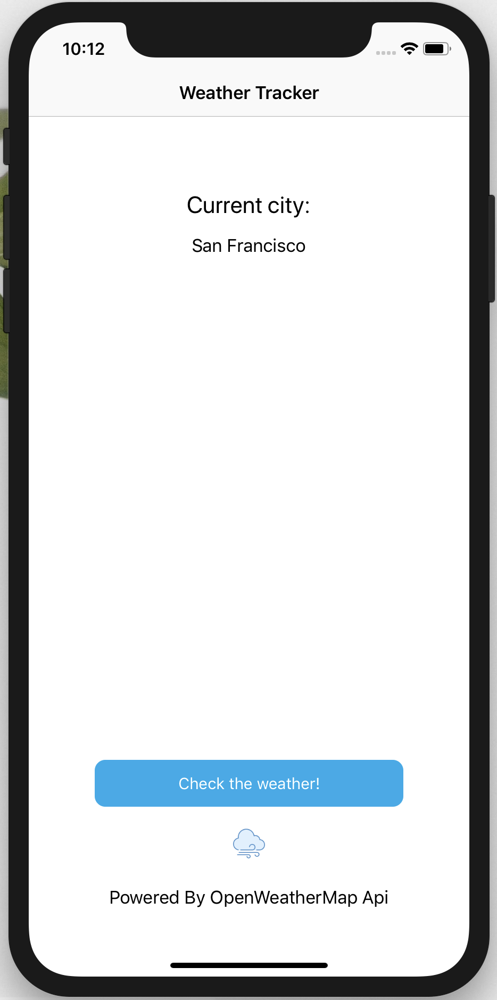

## Practice take home project 
- Includes using the OpenWeatherMap API
- Uses Apple built in MapKit framework
- Created clean networking layer to handle all requests to an api
- Includes LocationManager class to handle getting the user's current location

Users will be able to view the current weather based on their location.

#### App Design

